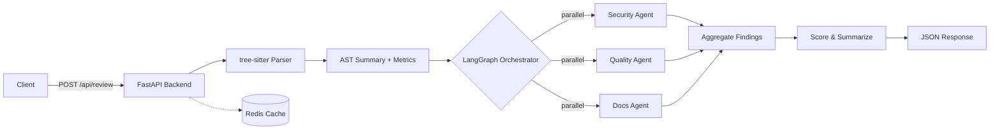

# Odin -- AI-Powered Multi-Agent Code Review

[](LICENSE)

Odin is an intelligent code review system that combines deterministic AST analysis with LLM-powered reasoning to deliver thorough, accurate, and actionable code reviews. By parsing source code with tree-sitter for structural understanding and then dispatching specialized AI agents in parallel, Odin catches security vulnerabilities, maintainability issues, and documentation gaps that traditional linters miss -- while grounding every finding in concrete syntax-level evidence.

## Architecture



## Features

- **Hybrid Analysis** -- tree-sitter AST parsing feeds structural context into every LLM agent, reducing hallucinations and grounding findings in real code structure.
- **Parallel Multi-Agent Pipeline** -- Security, Quality, and Documentation agents run concurrently via LangGraph, cutting wall-clock review time.
- **Language Support** -- Python, JavaScript, TypeScript, Go, Rust, Java, and more through tree-sitter grammars.
- **Deterministic Metrics** -- Cyclomatic complexity, nesting depth, function length, and parameter counts computed from the AST before any LLM call.
- **Caching** -- Redis-backed caching avoids redundant reviews for identical code submissions.
- **Evaluation Suite** -- Built-in benchmark runner with precision/recall scoring against curated samples.
- **Structured Output** -- Every finding includes category, severity, title, description, and line-level location.

## Quick Start

```bash
# Clone the repository
git clone https://github.com/rahulmod/odin.git && cd odin

# Set your API key
echo "ANTHROPIC_API_KEY=your-key-here" > .env

# Start the stack
docker compose up --build
```

The API will be available at `http://localhost:8000` and the frontend at `http://localhost:3000`.

## How It Works

1. **Parse** -- The submitted code is parsed with tree-sitter to produce an AST summary (function signatures, class hierarchies, import graph) and quantitative metrics (complexity, nesting depth, line counts).

2. **Dispatch** -- LangGraph fans out three specialist agents in parallel, each receiving the source code and the AST context:
   - **Security Agent** -- Identifies injection flaws, hardcoded secrets, insecure patterns, and missing input validation.
   - **Quality Agent** -- Flags excessive complexity, deep nesting, code duplication, poor naming, and style violations.
   - **Docs Agent** -- Checks for missing docstrings, unclear function contracts, and undocumented parameters.

3. **Aggregate** -- Findings from all agents are merged, deduplicated, and sorted by severity. An overall quality score (0--100) is computed from the weighted findings.

4. **Respond** -- The final structured review is returned as JSON containing the score, summary, and detailed findings list.

## Tech Stack

| Component       | Technology         | Rationale                                                  |
| --------------- | ------------------ | ---------------------------------------------------------- |
| API Framework   | FastAPI            | Async-native, auto-generated OpenAPI docs, Pydantic models |
| Agent Orchestration | LangGraph      | Directed graph execution with parallel fan-out support     |
| AST Parsing     | tree-sitter        | Incremental, multi-language, zero-dependency C parser      |
| LLM Provider    | Anthropic Claude   | Strong code reasoning, structured output, long context     |
| Cache           | Redis              | Sub-millisecond reads, built-in TTL, lightweight           |
| Frontend        | React + TypeScript | Component model, type safety, rich ecosystem               |
| Bundler         | Vite               | Fast HMR, ESM-native, minimal config                      |
| Containerization| Docker Compose     | Single-command reproducible environment                    |

## API Reference

### `POST /api/review`

Submit code for review.

**Request body:**

```json
{
  "code": "def foo():\n    pass",
  "language": "python"
}
```

**Response:**

```json
{
  "score": 85,
  "summary": "Generally clean code with one minor documentation gap.",
  "findings": [
    {
      "category": "maintainability",
      "severity": "low",
      "title": "Missing docstring",
      "description": "Function `foo` lacks a docstring explaining its purpose.",
      "line": 1
    }
  ]
}
```

### `GET /api/health`

Health check endpoint. Returns `{"status": "ok"}`.

## Running the Evaluation Suite

```bash
cd backend
python -m eval.runner
```

The runner processes curated samples with known issues, invokes the full review pipeline, and reports precision, recall, and F1 scores per sample. Results are saved to `backend/eval/results/latest.json`.

## Design Decisions

- **Why tree-sitter?** -- Unlike regex-based linters, tree-sitter produces a full concrete syntax tree. This gives agents accurate function boundaries, nesting depths, and symbol resolution without relying on the LLM to parse code structure.

- **Why parallel agents?** -- Security, quality, and documentation concerns are largely independent review dimensions. Running them concurrently via LangGraph fan-out reduces end-to-end latency to the slowest single agent rather than the sum of all three.

- **Why deterministic metrics before LLM calls?** -- Computing complexity and structure from the AST first means agents receive factual measurements alongside the code. This reduces hallucinated metric claims and lets agents focus on higher-level reasoning.

- **Why Redis caching?** -- LLM calls are the dominant cost. Caching reviews by content hash avoids paying for repeat submissions and brings response times under 50ms for cache hits.

## License

This project is licensed under the MIT License. See [LICENSE](LICENSE) for details.
