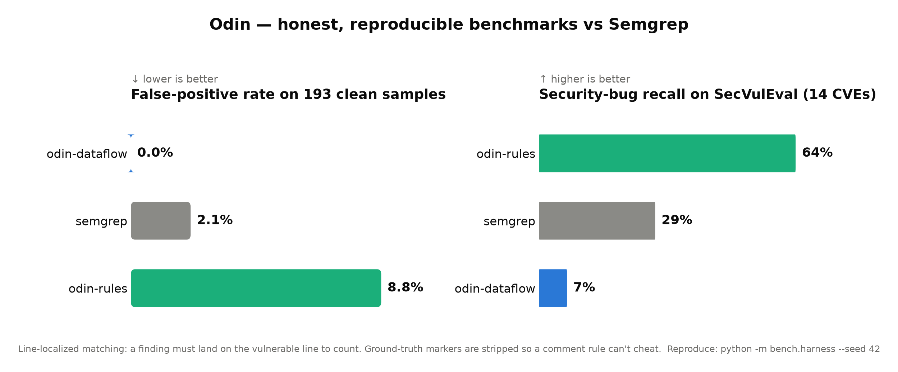

# Odin — Dataflow-Guided AI Code Review

[](https://github.com/RahulModugula/odin/actions/workflows/ci.yml)
[](LICENSE)
[](https://python.org)

**The taint-guided security reviewer for AI-generated code. MIT-licensed, self-hostable, and the only one that publishes an honest, reproducible false-positive rate.**

Dataflow taint analysis narrows the candidates; an LLM proves exploitability on the few that survive. Odin runs on your own infrastructure with your own model — OpenRouter, OpenAI, Anthropic, or a local LLM via LM Studio / Ollama — and every benchmark number ships with the command to reproduce it.



> **Why this exists:** 2026 studies put ~45% of AI-generated code at introducing a known security flaw — roughly **2.7× the vulnerability density** of human-written code — while security-review coverage runs 20–30% *lower* for AI-authored changes. Odin is the review layer built for that gap: it assumes the code was written fast and checks it like it wasn't.

Odin implements the [LLift (OOPSLA 2024)](https://www.cs.ucr.edu/~zhiyunq/pub/oopsla24_llift.pdf) / [INFERROI (ICSE 2025)](https://conf.researchr.org/details/icse-2025) architecture: cheap taint propagation narrows the search space, then an LLM reasons about exploitability only on real candidates. A feedback loop suppresses known false-positive (source, sink) pairs *before* the LLM runs — so cost and noise drop together over time.

**FP rate on 193 clean-code samples** — the metric nobody else publishes: dataflow taint tracker **0.0%**, deterministic rules **8.8%**, vs Semgrep's **2.1%**. On real security bugs (SecVulEval), `odin-rules` catches **64%** to Semgrep's 29%, both at 100% precision. Every recall number is computed under **line-localized matching** — a finding must land on the vulnerable line to count — with ground-truth markers stripped so no rule can score by grepping for them. Full methodology, and where Odin loses: [`leaderboard.md`](backend/bench/reports/leaderboard.md).

---

## One-line install

```bash
# No Docker, no server, no checkout — just works (BYOK via env var)
uvx odin-review review path/to/file.py

# Rules only — instant, no LLM
uvx odin-review review path/to/file.py --rules-only
```

Set your provider once:

```bash
export ODIN_LLM_PROVIDER=openrouter
export ODIN_OPENROUTER_API_KEY=sk-or-v1-...
export ODIN_OPENROUTER_MODEL=anthropic/claude-sonnet-4-5
```

---

## GitHub App — one-click install

Install the GitHub App and Odin automatically reviews every PR in your repos — no webhook setup, no token management.

```
https://your-odin-instance/api/github/app/install
```

Or self-host and register your own App:

```bash
# .env
ODIN_GITHUB_APP_ID=123456
ODIN_GITHUB_APP_PRIVATE_KEY_PATH=/run/secrets/odin-app.pem
ODIN_GITHUB_APP_WEBHOOK_SECRET=your-secret
```

Odin posts structured reviews with inline comments, severity badges, and fix suggestions on every PR automatically.

---

## Features

| Feature | Details |
|---|---|
| **Dataflow triage** | Intra-procedural taint analysis → LLM reasons about exploitability on narrowed candidates only (LLift/INFERROI architecture) |
| **29 deterministic rules** | Python, JS, TS, Go, Rust, Java — zero cost, instant |
| **Learning feedback loop** | Mark a finding false-positive twice → that (source, sink) pair is suppressed before the LLM runs next time |
| **Honest leaderboard** | Public FP-rate benchmark on 193 clean samples + CVE recall; every number reproducible, line-localized, contamination-controlled |
| **uvx one-binary install** | `uvx odin-review review <file>` — works from a clean machine, BYOK |
| **GitHub App** | One-click install, auto-registers webhook, reviews every PR |
| **GitHub webhook** | Manual webhook setup if you prefer |
| **MCP server** | Use Odin as a tool inside Claude Code or Cursor |
| **Local LLMs** | LM Studio, Ollama, or any OpenAI-compatible endpoint |
| **BYOK** | OpenRouter, OpenAI, Anthropic |
| **6 languages** | Python, JavaScript, TypeScript, Go, Rust, Java |

---

## How it works

```
Client / GitHub PR ──▶ FastAPI + LangGraph
                              │
                   tree-sitter AST parse
                              │
                     LangGraph fan-out (parallel)
         ┌────────────────────┼──────────────────┬──────────────────┐
         ▼                    ▼                  ▼                  ▼
   SecurityAgent        QualityAgent        DocsAgent       DataflowTriage
   (LLM call)           (LLM call)         (LLM call)      taint→LLM triage
         │                    │                  │                  │
         └────────────────────┴──────────────────┴──────────────────┘
                              │
                        Rules Engine
                     (27+ instant checks)
                              │
                         synthesize()
                    (dedup + score + sort)
                              │
               GitHub PR review / Web UI / CLI / SSE stream
```

**DataflowTriage pipeline:**
1. Walk each function body with an intra-procedural taint tracker (assignment-chain + call-arg propagation)
2. Check the (source_sig, sink_sig) suppression table — skip known-FP pairs before the LLM runs
3. LLM reasons about exploitability for remaining candidates only (≤20 per file, `asyncio.Semaphore(4)`)
4. Confirmed false positives feed back into the suppression table — noise drops over time

---

## Benchmarks

**FP rate is a first-class metric. We report where Odin loses.**

### False Positive Rate — 193 clean-code samples

| Tool | FP Rate | Notes |
|---|---|---|
| **`odin-dataflow`** | **0.0%** | 0/193 — dataflow taint tracker refuses to fire without a source→sink path |
| `semgrep` | 2.1% | 4/193 — the open-source reference point |
| `odin-rules` | 8.8% | 17/193 — pattern rules trade precision for coverage |

### Recall on real security bugs — SecVulEval (14 CVEs)

| Tool | Recall | Precision | F1 |
|---|---|---|---|
| **`odin-rules`** | **64%** | 100% | 0.78 |
| `semgrep` | 29% | 100% | 0.44 |
| `odin-dataflow` | 7% | 100% | 0.13 |

### The hard datasets — reported anyway

| Tool | CVE-Bench crits (50 · SOTA ~13%) | SWE-bench Verified (50 · logic bugs) |
|---|---|---|
| `odin-rules` | 8% | 4% |
| `semgrep` | 8% | 0% |
| `odin-dataflow` | 0% | 2% |

> **On honesty:** an earlier version of this leaderboard reported *86% SecVulEval, 32% CVE-Bench, and 100% SWE-bench* for `odin-rules`. Those came from a scorer that counted **any** finding anywhere in a sample as a hit — and worse, the benchmark planted a `# BUG:` comment on each buggy line, which a comment-linting rule "detected." We rewrote the scorer to require the finding to land on the vulnerable line, and to strip the planted markers before the tool sees the code. The numbers above are what survived. CVE-Bench is genuinely brutal (Odin ties Semgrep below SOTA); SWE-bench measures logic bugs, which deterministic SAST isn't built to catch. The full story is in [`leaderboard.md`](backend/bench/reports/leaderboard.md).

Every number is reproducible — dataset SHAs pinned, seed fixed at 42:

```bash
cd backend
python -m bench.harness --seed 42                           # full head-to-head
python -m bench.harness --dataset clean_corpus --tool semgrep --seed 42
python -m bench.harness --dataset cvebench --tool odin-rules --seed 42
python -m bench.harness --json                              # machine-readable
```

Full methodology + every number: [`bench/reports/leaderboard.md`](backend/bench/reports/leaderboard.md)

> CodeRabbit, Greptile, Qodo, CodeQL, and Copilot runners are wired into the same harness
> but require API keys / hosted access — once enabled they drop into the tables above.

---

## Odin on Odin

We run Odin against its own backend. The rules-only pass currently reports **102 findings (6 critical, 48 high)** — and the honest read is the point: **all 6 "critical" findings are false positives.** They fire on Odin's own machinery — the rule that *detects* `eval()` necessarily contains the string `eval`; the dataflow sink registry *lists* `pickle` and `yaml.load` as dangerous sinks. None has a user-controlled source→sink path, which is exactly why the **dataflow tracker flags zero of them.**

That's the whole thesis in one screenshot: pattern rules are noisy (that's the 8.8% FP rate), and taint analysis is what buys back precision. We'd rather show you the false positives on our own code than hide them.

```bash
uvx odin-review review backend/app --rules-only    # reproduce it
```

---

## Quick Start — self-hosted

### Option 1: LM Studio (local, fully private)

```bash
git clone https://github.com/RahulModugula/odin
cd odin
cp .env.example .env

# .env:
# ODIN_LLM_PROVIDER=lmstudio
# ODIN_LMSTUDIO_MODEL=qwen2.5-coder-32b

docker compose -f docker-compose.yml -f docker-compose.lmstudio.yml up
```

Open http://localhost:3000

### Option 2: OpenRouter (BYOK)

```bash
# .env:
# ODIN_LLM_PROVIDER=openrouter
# ODIN_OPENROUTER_API_KEY=sk-or-v1-...
# ODIN_OPENROUTER_MODEL=anthropic/claude-sonnet-4-5

docker compose up
```

### Option 3: OpenAI / any OpenAI-compatible API

```bash
# ODIN_LLM_PROVIDER=openai
# ODIN_LLM_API_KEY=sk-...
# ODIN_LLM_MODEL=gpt-4o-mini
docker compose up
```

---

## CLI

```bash
# Install once (no checkout required)
uvx odin-review review path/to/file.py

# Rules only — instant, no LLM, no server
uvx odin-review review path/to/file.py --rules-only

# Staged changes (pre-push check)
uvx odin-review review --staged --rules-only

# Fail CI on high+ severity
uvx odin-review review --staged --fail-on high

# JSON output for scripting
uvx odin-review review path/to/file.py --json | jq .

# Filter by severity and confidence
uvx odin-review review backend/ --min-severity high --min-confidence 0.8

# Noise budget — keep only the top N findings (severity DESC, confidence DESC)
uvx odin-review review backend/ --max-findings 10

# AI Code Validator mode — sharpens the review for Copilot/ChatGPT-authored code
uvx odin-review review generated_file.py --local --ai-generated
```

Install as a git pre-push hook:

```bash
bash cli/install-hook.sh
```

**Flags:** `--staged` · `--diff REF` · `--rules-only` · `--local` · `--quiet` · `--min-severity` · `--min-confidence` · `--fail-on` · `--fail-on-score` · `--max-findings` · `--ai-generated` · `--json` · `--sarif`

## Editor + demo surfaces

- **VS Code extension**: [`vscode-extension/`](vscode-extension/README.md) — on-save rules, one-click full AI review, hover squiggles.
- **Live demo instance**: deploy the public, rate-limited demo with the config in [`infra/demo/`](infra/demo/README.md) (`ODIN_DEMO_ENABLED=true` exposes `POST /api/demo/review`).
- **Policy-as-code**: drop YAML files in [`.odin/rules/`](.odin/rules/) to add custom pattern-based rules without writing Python — see [`app/rules/custom_loader.py`](backend/app/rules/custom_loader.py) for the schema.

---

## GitHub Webhook (manual setup)

```bash
openssl rand -hex 32  # generate webhook secret
```

In your GitHub repo: Settings → Webhooks → Add webhook
- Payload URL: `https://your-odin/api/webhook/github`
- Content type: `application/json`
- Events: Pull requests, Issue comments

```bash
# .env
ODIN_GITHUB_TOKEN=ghp_...
ODIN_GITHUB_WEBHOOK_SECRET=your-secret
```

Bot commands in PRs: `@odin review` · `@odin help`

---

## Deterministic Rules Reference

| ID | Name | Severity | Language |
|---|---|---|---|
| PY001 | Bare except clause | HIGH | Python |
| PY002 | Mutable default argument | HIGH | Python |
| PY003 | eval()/exec() | CRITICAL | Python |
| PY004 | Hardcoded secret/credential | CRITICAL | Python |
| PY005 | SQL string formatting | CRITICAL | Python |
| PY006 | High cyclomatic complexity | MEDIUM | Python |
| PY007 | Overly long function | MEDIUM | Python |
| PY008 | Excessive nesting depth | MEDIUM | Python |
| PY009 | Missing type hints | LOW | Python |
| JS001 | Use of var | LOW | JS/TS |
| JS002 | console.log in code | LOW | JS/TS |
| JS003 | XSS via innerHTML | HIGH | JS/TS |
| JS004 | Deep callback nesting | MEDIUM | JS/TS |
| JS005 | JWT decode without verify | HIGH | JS/TS |
| JS006 | Prototype pollution | HIGH | JS/TS |
| TS001 | TypeScript `any` type | MEDIUM | TypeScript |
| TS002 | Non-null assertion overuse | MEDIUM | TypeScript |
| GO001 | Error return value ignored | HIGH | Go |
| GO002 | panic() in library code | HIGH | Go |
| GO003 | Goroutine leak | MEDIUM | Go |
| GO004 | SQL injection via fmt.Sprintf | CRITICAL | Go |
| GO005 | Mutex without deferred Unlock | MEDIUM | Go |
| GO006 | context.Context not first param | LOW | Go |
| GO007 | Hardcoded IP address | LOW | Go |
| GO008 | Unbuffered channel send deadlock | MEDIUM | Go |
| CL001 | TODO/FIXME comment | INFO | All |
| CL002 | File too large | MEDIUM | All |
| CL003 | Magic number | LOW | All |
| CL004 | Hardcoded credential | CRITICAL | All |

---

## Configuration (.odin.yaml)

```yaml
provider:
  name: openrouter
  model: anthropic/claude-sonnet-4-5

review:
  agents: [security, quality, docs]
  severity_threshold: low

ignore:
  paths: [vendor/, node_modules/, "*.min.js"]
  rules: [CL001]

quality_gate:
  min_score: 70
  max_critical: 0
  block_on_fail: false
```

---

## MCP Server

Use Odin as a tool inside Claude Code, Cursor, or any MCP client — it reviews the diff before you commit it.

**Claude Code (one line):**

```bash
claude mcp add --scope user odin -- uvx --from odin-review odin-mcp
```

**Cursor / Windsurf** — add to `~/.cursor/mcp.json`:

```json
{
  "mcpServers": {
    "odin": { "command": "uvx", "args": ["--from", "odin-review", "odin-mcp"] }
  }
}
```

Available tools: `review_diff` (the primary PR-review path), `review_code`, `analyze_file`, `get_findings`, `query_codebase`.

---

## Development

```bash
cd backend
uv venv && uv pip install -e ".[dev]"
uvicorn app.main:app --reload

# Tests
pytest tests/ -v --cov=app

# Lint
ruff check . && ruff format --check . && mypy --strict app/

# Benchmark
python -m bench.harness --dataset clean_corpus
```

---

## vs CodeRabbit

The honest comparison — including where CodeRabbit wins.

| | Odin | CodeRabbit Free | CodeRabbit Pro |
|---|---|---|---|
| **Price** | Free | Free (limited) | $24/dev/mo |
| **Open source** | ✅ MIT | ❌ | ❌ |
| **Self-hostable** | ✅ | ❌ | ❌ |
| **Data privacy** | ✅ never leaves your infra | ❌ | ❌ |
| **Local LLMs (LM Studio, Ollama)** | ✅ | ❌ | ❌ |
| **BYOK (OpenRouter, OpenAI)** | ✅ | ❌ | ✅ |
| **Published FP rate** | ✅ [0.0% dataflow / 8.8% rules on 193 clean samples](backend/bench/reports/leaderboard.md) | ❌ | ❌ |
| **Reproducible benchmarks** | ✅ `python -m bench.harness` | ❌ | ❌ |
| **Taint-guided triage (LLift/INFERROI)** | ✅ | ❌ | ❌ |
| **Learning feedback loop** | ✅ suppresses FPs at generator level | ❌ | limited |
| **GitHub App one-click install** | ✅ | ✅ | ✅ |
| **GitHub webhook** | ✅ | ✅ | ✅ |
| **CLI (`uvx odin-review review`)** | ✅ no Docker needed | ❌ | ❌ |
| **PR summary & walkthrough** | ✅ | ✅ | ✅ |
| **Inline comments** | ✅ | ✅ | ✅ |
| **Deterministic rules** | ✅ 29 rules, 6 languages | ✅ 40+ | ✅ 40+ |
| **MCP server** | ✅ Claude Code / Cursor | ❌ | ❌ |
| **GitLab / Bitbucket** | ❌ (GitHub only) | ✅ | ✅ |

**Where CodeRabbit wins:** more platform integrations (GitLab, Bitbucket, Azure DevOps), more rules out of the box, more mature bot UX, and a larger team maintaining it. If you're on GitLab or want something fully managed, CodeRabbit is a better fit today.

**Where Odin wins:** if your code can't leave your infrastructure, if you want to understand and audit what's running, if you want FP rates that actually drop over time, or if you want to run it free with your own model.

### vs the other open-source options

Odin isn't the only self-hostable reviewer anymore — [Kodus](https://kodus.io) and [PR-Agent / Qodo Merge](https://github.com/qodo-ai/pr-agent) are both credible OSS choices, and they're good. Two things set Odin apart:

- **License.** Odin is **MIT**; Kodus is **AGPLv3**. If you want to embed, fork, or ship a reviewer inside a commercial product without copyleft obligations, MIT is the one you can actually build on.
- **Architecture.** Odin leads with **taint-guided triage** (dataflow narrows candidates → LLM proves exploitability, the LLift/INFERROI lineage) and a **published, reproducible FP rate**. Most reviewers — open or closed — are prompt-over-diff; none publish a false-positive number you can regenerate. If you're on GitLab, want the most mature bot UX today, or want a hosted option, the tools above may fit you better.

---

## License

MIT — use it, fork it, make it better.
