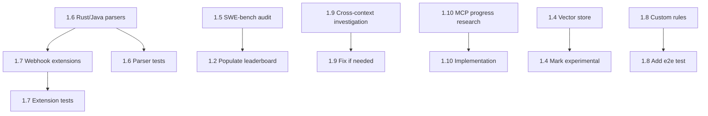

# Tier 1 — Product Quality: Implementation Plan

> **Scope:** 10 items from the Tier 1 product quality spec. Items 1.1 and 1.3 are explicitly
> deferred. The remaining 7 items are actionable now, ordered by dependency and risk.

## Summary of Findings

| Item | Status | Risk | Effort |
|------|--------|------|--------|
| 1.1 Agent tool-calling refactor | DEFERRED | — | — |
| 1.2 Populate Odin leaderboard rows | Actionable | Low | Medium |
| 1.3 Hosted-competitor benchmarks | POST-LAUNCH | — | — |
| 1.4 Vector embedding layer | Actionable — Option B recommended | Low | Small |
| 1.5 Verify SWE-bench 100% recall | Actionable — criterion is loose | High | Medium |
| 1.6 Rust/Java parser coverage | Actionable — grammars missing | High | Medium |
| 1.7 Webhook processor extensions | Actionable — .rs/.java missing | High | Small |
| 1.8 Custom-rules engine coverage | Mostly done — minor gap | Low | Small |
| 1.9 Multi-file PR cross-context | Needs investigation | Medium | Medium |
| 1.10 MCP streaming/progress | Actionable | Medium | Medium |

---

## 1.1 Agent tool-calling refactor — DEFERRED

No action. Per the spec, this is deferred post-launch due to langchain adapter conflicts
between structured-output JSON mode and native tool-binding.

---

## 1.2 Populate Odin rows in leaderboard.md

### Current state
- [`leaderboard.md`](backend/bench/reports/leaderboard.md) contains only `semgrep` rows across all 4 tables
- Raw result JSONs exist in [`bench/reports/results/`](backend/bench/reports/results/) but none for `odin-rules` or `odin-dataflow`
- The README quotes 86% SecVulEval recall, 32% CVE-Bench, 0.0% dataflow FP rate — these are uncommitted

### Steps
1. Run `cd backend && python -m bench.harness --seed 42 --tool odin-rules` to generate `odin-rules` results
2. Run `cd backend && python -m bench.harness --seed 42 --tool odin-dataflow` to generate `odin-dataflow` results
3. Verify raw JSON files appear in `bench/reports/results/`
4. Update [`leaderboard.md`](backend/bench/reports/leaderboard.md) with the generated rows for both tools
5. Commit raw JSONs + updated leaderboard in a single commit
6. Re-run to confirm ±2% reproducibility

### Acceptance
- `leaderboard.md` has rows for `odin-rules`, `odin-dataflow`, and `semgrep` in every table
- Raw JSON result files are committed
- Second run produces numbers within ±2%

---

## 1.3 Hosted-competitor benchmark rows — POST-LAUNCH

No action now. Add a caveat note in leaderboard.md if not already present.

---

## 1.4 Vector embedding layer — ship or remove

### Current state
- [`vector_store_enabled: bool = False`](backend/app/config.py:27) — disabled by default
- [`vector_store.py`](backend/app/graph_rag/vector_store.py) implements chunking + ChromaDB integration
- **README search for "vector", "embedding", "semantic" returned ZERO results** — the README does NOT claim this feature
- The disconnect described in the spec is less severe than assumed: no false advertising exists

### Recommendation: Option B — mark experimental
Since the README does not claim vector search, the safest path is:
1. Add a code comment in [`config.py`](backend/app/config.py:27) marking `vector_store_enabled` as experimental
2. Add a startup log line in [`vector_store.py`](backend/app/graph_rag/vector_store.py) confirming status when accessed
3. Open a tracking issue to ship it properly later
4. No README changes needed — already consistent

### Acceptance
- `config.py` has a comment marking the feature experimental
- No README text references vector search as a shipping feature ✅ already true

---

## 1.5 Verify SWE-bench 100% recall ⚠ HIGH PRIORITY

### Current state — CRITICAL FINDING
The scoring logic in [`scorer.py`](backend/bench/scorer.py:15) uses a **sample-level** matching criterion:
- For `VULNERABLE` samples: if the tool produces **any** finding with confidence >= 0.0, it counts as a true positive
- There is **no line-range overlap check** — the scorer does not compare finding locations against ground-truth hunks
- The SWE-bench samples in [`swebench_verified.py`](backend/bench/datasets/swebench_verified.py) are self-contained code snippets with embedded `# BUG:` comments
- The `classify()` function at line 26 simply checks `flagged = len(relevant) > 0`

This means a tool that flags **anything** in a vulnerable sample gets credit — the 100% recall claim is likely inflated.

### Steps
1. Document the current matching criterion explicitly in [`leaderboard.md`](backend/bench/reports/leaderboard.md) under Methodology
2. Evaluate whether sample-level matching is appropriate for these self-contained snippets — it may be defensible since each sample IS the vulnerable code
3. If tightening is needed: add a `matches` function to [`scorer.py`](backend/bench/scorer.py) that requires finding location overlap with the `# BUG:` annotated lines
4. Re-run the benchmark with tightened criterion
5. Update leaderboard and README with honest numbers

### Acceptance
- Methodology section in `leaderboard.md` documents the exact matching criterion
- Recall number survives tightening, or the new lower number is reported honestly

---

## 1.6 Rust / Java tree-sitter parser coverage ⚠ HIGH PRIORITY

### Current state — CONFIRMED GAP
- [`Language` enum](backend/app/models/enums.py:4) lists `RUST = "rust"` and `JAVA = "java"`
- [`languages.py`](backend/app/parsers/languages.py:1) only imports `tree_sitter_python` and `tree_sitter_javascript` — **no `tree_sitter_rust` or `tree_sitter_java` imports**
- The `_LANGUAGES` dict at line 26 only has `python`, `javascript`, `typescript`, `go`
- Calling `parse_code(code, Language.RUST)` will hit [`get_language()`](backend/app/parsers/languages.py:38) → returns `None` → returns empty structure
- README line 70 claims "6 languages: Python, JavaScript, TypeScript, Go, Rust, Java"

### Steps
1. Add `tree-sitter-rust` and `tree-sitter-java` to [`pyproject.toml`](backend/pyproject.toml) dependencies
2. Add optional imports in [`languages.py`](backend/app/parsers/languages.py) following the existing `tree_sitter_typescript`/`tree_sitter_go` pattern:
   ```python
   try:
       import tree_sitter_rust
       _rust_language = Language(tree_sitter_rust.language())
   except Exception:
       _rust_language = None
   
   try:
       import tree_sitter_java
       _java_language = Language(tree_sitter_java.language())
   except Exception:
       _java_language = None
   ```
3. Wire `_rust_language` and `_java_language` into `_LANGUAGES` dict
4. Add Rust and Java node-type mappings to the dictionaries in [`tree_sitter_parser.py`](backend/app/parsers/tree_sitter_parser.py):
   - `_COMPLEXITY_NODES` — Rust: `if_expression`, `match_expression`, `for_expression`, `while_expression`, etc.
   - `_FUNCTION_NODES` — Rust: `function_item`; Java: `method_declaration`, `constructor_declaration`
   - `_CLASS_NODES` — Rust: `struct_item`, `enum_item`; Java: `class_declaration`, `interface_declaration`
   - `_IMPORT_NODES` — Rust: `use_declaration`; Java: `import_declaration`
   - `_COMMENT_NODES` — Rust: `line_comment`, `block_comment`; Java: `line_comment`, `block_comment`
5. Write test `test_tree_sitter_parses_rust` asserting non-empty `.functions` for a Rust fn
6. Write test `test_tree_sitter_parses_java` asserting non-empty `.functions` for a Java method

### Acceptance
- Both tests pass green in CI
- Manually reviewing `.rs` and `.java` files produces non-trivial parse output

---

## 1.7 Webhook processor file extensions ⚠ HIGH PRIORITY

### Current state — CONFIRMED GAP
Two locations need fixing:

1. **[`webhook_processor.py`](backend/app/services/webhook_processor.py:30)** — `EXTENSION_TO_LANGUAGE` dict:
   ```python
   EXTENSION_TO_LANGUAGE: dict[str, Language] = {
       ".py": Language.PYTHON,
       ".js": Language.JAVASCRIPT,
       ".jsx": Language.JAVASCRIPT,
       ".ts": Language.TYPESCRIPT,
       ".tsx": Language.TYPESCRIPT,
       ".go": Language.GO,
   }
   ```
   Missing: `.rs` → `Language.RUST`, `.java` → `Language.JAVA`

2. **[`mcp/server.py`](backend/app/mcp/server.py:25)** — `_EXTENSION_MAP` dict:
   ```python
   _EXTENSION_MAP: dict[str, Language] = {
       ".py": Language.PYTHON,
       ".js": Language.JAVASCRIPT,
       ".ts": Language.TYPESCRIPT,
       ".tsx": Language.TYPESCRIPT,
       ".go": Language.GO,
   }
   ```
   Missing: `.rs` → `Language.RUST`, `.java` → `Language.JAVA`

### Steps
1. Add `".rs": Language.RUST` and `".java": Language.JAVA` to `EXTENSION_TO_LANGUAGE` in [`webhook_processor.py`](backend/app/services/webhook_processor.py:30)
2. Add `".rs": Language.RUST` and `".java": Language.JAVA` to `_EXTENSION_MAP` in [`mcp/server.py`](backend/app/mcp/server.py:25)
3. Verify [`should_skip_file()`](backend/app/services/webhook_processor.py:56) uses case-insensitive comparison — it does via `path.suffix.lower()` ✅
4. Add test verifying `.rs` and `.java` files are not skipped by `should_skip_file()`

### Acceptance
- A PR with changed `example.rs` and `Example.java` triggers full review processing

---

## 1.8 Custom-rules engine coverage

### Current state — ALREADY WELL-COVERED
The test file [`test_custom_rules.py`](backend/tests/test_custom_rules.py) already includes:

- **`test_rule_fires_on_matching_line()`** (line 176) — loads a `_CustomPatternRule`, passes matching code, asserts finding with correct `line_start`, `severity`, `source`
- **`test_rule_skips_non_matching_code()`** (line 186) — negative control, asserts empty findings
- **`test_rule_emits_one_finding_per_matching_line()`** (line 192) — multiple matches
- **`test_rule_respects_wrong_language()`** (line 200) — engine-level language gating
- **`test_register_loads_and_counts()`** (line 216) — full integration: write YAML → `register_custom_rules()` → `engine.check_all()` → assert finding

The spec asks for a test loading `example-no-pickle-loads.yml` from `.odin/rules/` end-to-end. This specific committed rule file is not exercised in tests.

### Steps
1. Add test `test_committed_example_rule_detects_pickle_loads` that:
   - Loads `.odin/rules/example-no-pickle-loads.yml` via `load_custom_rules()` using the repo root
   - Registers rules into a `RuleEngine`
   - Passes `pickle.loads(user_input)` code snippet
   - Asserts finding is produced with correct severity and rule ID
2. Add negative test with safe code `data = json.loads(user_input)` → no finding

### Acceptance
- End-to-end test covers: load YAML → compile pattern → evaluate → assert finding
- Negative control test confirms non-matching code produces no finding

---

## 1.9 Multi-file PR cross-context

### Current state
The plumbing exists but needs verification:

1. **[`enrich_context_node`](backend/app/agents/graph.py:204)** extracts `pr_context_files` → `cross_file_paths` → passes to `build_context()`
2. **[`fan_out_to_agents`](backend/app/agents/graph.py:241)** passes `codebase_context` string to each agent
3. **[`build_review_prompt`](backend/app/agents/prompts.py:160)** renders `codebase_context` in a `## Codebase Context` section (line 200-201)
4. **Key question:** Does `build_context()` in the graph_rag module actually include cross-file symbol signatures?

### Steps
1. Read `app/graph_rag/context_builder.py` to trace how `cross_file_paths` is used
2. Verify that when file A references a symbol in file B, and file B is in `cross_file_paths`, the signature appears in the returned context string
3. If the plumbing exists but context is empty: fix `build_context()` to include cross-file signatures
4. If the template renders but agents ignore it: no code change needed, just document
5. Write integration test: two-file PR where `file_a.py` calls `dangerous_function` from `file_b.py`, assert the agent input contains `dangerous_function` signature

### Acceptance
- Integration test confirms cross-file symbol information reaches agent prompts

---

## 1.10 MCP streaming / progress

### Current state
- [`mcp/server.py`](backend/app/mcp/server.py) uses `FastMCP` from `mcp.server.fastmcp`
- [`_run_review()`](backend/app/mcp/server.py:44) calls `review_graph.ainvoke()` — single blocking call, no progress
- No progress reporting infrastructure exists

### Steps
1. Research FastMCP progress reporting API — check if `ctx.report_progress()` or similar is available
2. Refactor `_run_review()` to accept an optional progress callback
3. Instrument the LangGraph execution to emit progress after each node:
   - `parse_code` → "Odin reviewing… parsing complete"
   - `enrich_context` → "Odin reviewing… context enriched"
   - Each agent → "Odin reviewing… 3/7 agents complete"
   - `synthesize` → "Odin reviewing… synthesizing findings"
4. Wrap progress emission in try/except to gracefully no-op on stdio transport
5. Add unit test verifying callback is invoked per pipeline node
6. Add test for stdio fallback path — no errors raised

### Acceptance
- MCP clients display incremental progress during reviews > 5 seconds
- Unit test confirms per-node callback invocation
- Stdio fallback does not raise errors

---

## Dependency Graph



## Recommended Execution Order

1. **1.6 + 1.7** — Rust/Java parser coverage + webhook extensions — these are the same root cause and should be a single PR
2. **1.5** — SWE-bench recall audit — high risk, needs honest numbers before launch
3. **1.2** — Populate leaderboard — depends on 1.5 for honest SWE-bench numbers
4. **1.9** — Cross-context investigation — may reveal a simple template fix or a deeper gap
5. **1.8** — Custom-rules e2e test — small, low risk
6. **1.4** — Vector store experimental marking — trivial
7. **1.10** — MCP streaming — independent, can be done anytime
